# How to set up MySQL Community Server and MySQL Workbench
This guide was originally meant to be used for DATA 220P at UC Irvine in Fall 2024. Note that the author has only attempted installation for Windows 11, so any debugging on Mac OS or Linux will have to be done on your own. Feel free to jump around to the sections you need help with.
- [MySQL Community Server](#mysql-community-server)
     - [MySQL Server Setup Wizard](#mysql-server-setup)
     - [MySQL Configurator Wizard](#mysql-configurator-setup)
- [MySQL Workbench](#mysql-workbench)

## MySQL Community Server
The first step is to download the latest version of MySQL Community Server, found at [https://dev.mysql.com/downloads/mysql/](https://dev.mysql.com/downloads/mysql/). The version as of writing this guide is v9.0.1.

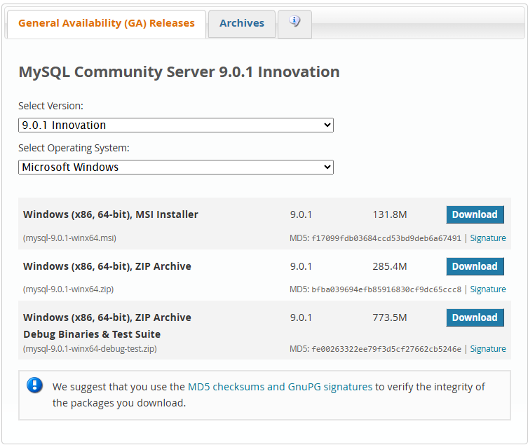

From this list of installers, click Download next to the Windows MSI Installer. This will bring you to a page that looks like this:

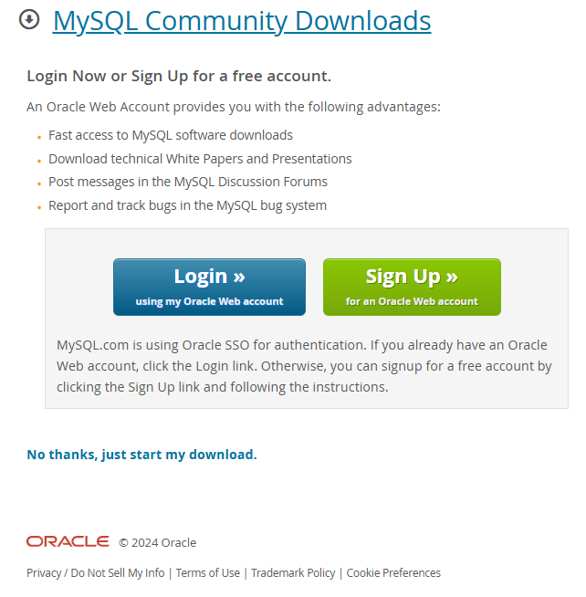

If you don't want to log in or sign up for an Oracle Web Account, just click the **No thanks, just start my download.** button below the account buttons. This should download a file called `mysql-9.0.1-winx64.msi` to your computer. This is the installer for MySQL Community Server. Run this file.

### MySQL Server Setup
You should see an application pop up called MySQL Server 9.0 Setup with a welcome page to the installation wizard. We will now go through the steps for this wizard.
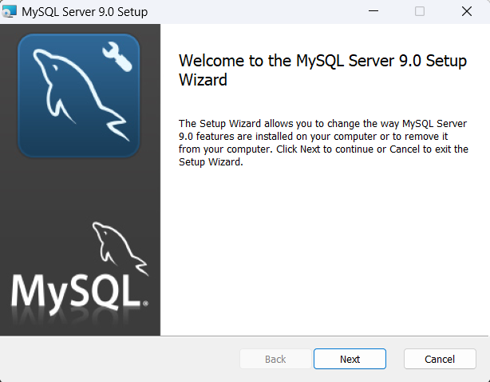
1. Click Next. You should see an End-User License Agreement. Accept the terms and click Next.
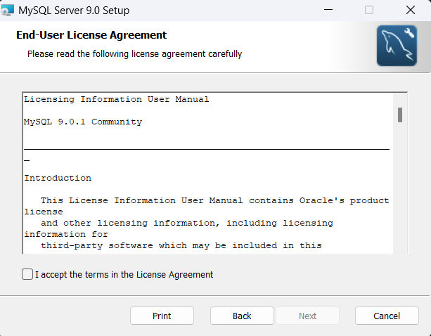
2. You should see **Choose Setup Type** at the top of the wizard. Click *Typical*.

3. The wizard should now say **Ready to install MySQL Server 9.0**. Click Install. When Windows asks for permission, accept it.
4. Once installation is complete, you should see a screen that says **Completed the MySQL Server Setup Wizard**. At the bottom of this screen, there is a check box that says **Run MySQL Configurator**. Make sure that this is checked, as this is the next step for the installation. Click Finish.
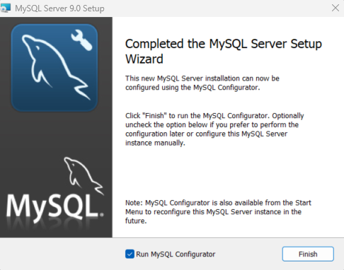

# MySQL Configurator Setup
Windows will ask if you want mysql_configurator.exe to have some permissions; allow it. Now you should see an application window titled MySQL Configurator with a welcome page for this configurator. We will now go through the steps for this configurator wizard.
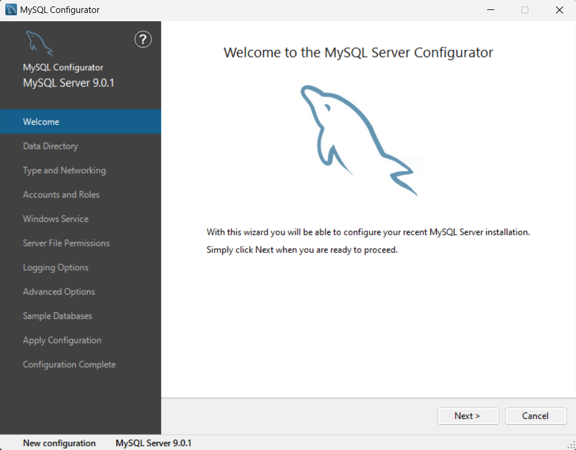
1. Click Next. You should see a screen titled **Data Directory**. This is where MySQL Server 9.0 and all its related data will be stored. The default is usually good enough, but if you have a specific directory that you want, choose that one instead. Click Next.
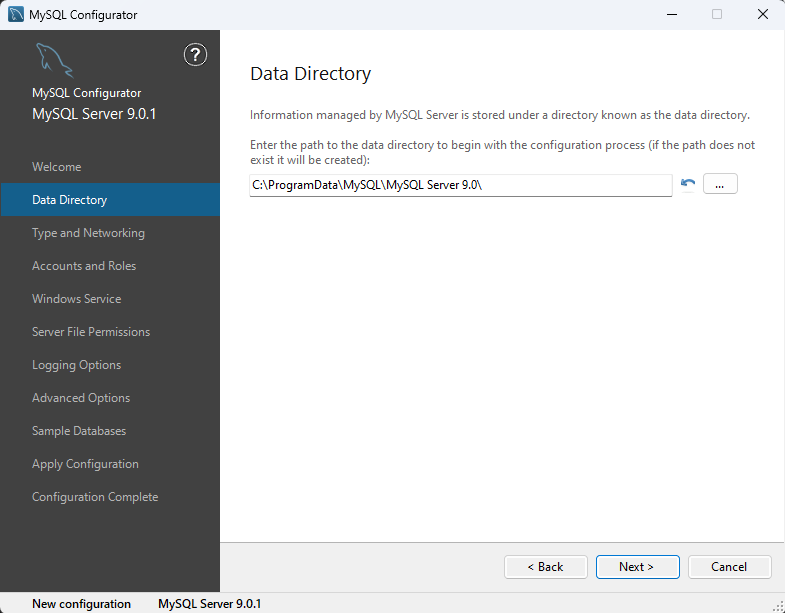
2. The screen should be titled **Type and Networking**. Make sure the Config Type is `Development Computer`, connectivity has TCP/IP checked, Port is `3306`, X protocol Port is `33060`, and *Open Windows Firewall ports for network access* is checked. These are usually the default options. It is also a good idea to check **Show Advanced and Logging Options** before you click Next.
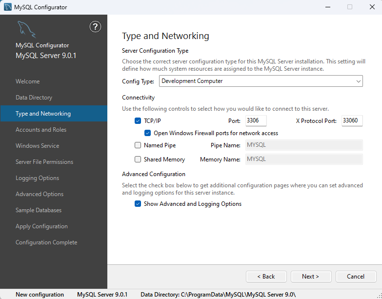
3. The next screen should be titled **Accounts and Roles**. This is where you will choose a MySQL Root Password, so make sure it is strong. You can also create MySQL User Accounts, but this is not necessary. After entering a root password, click Next.
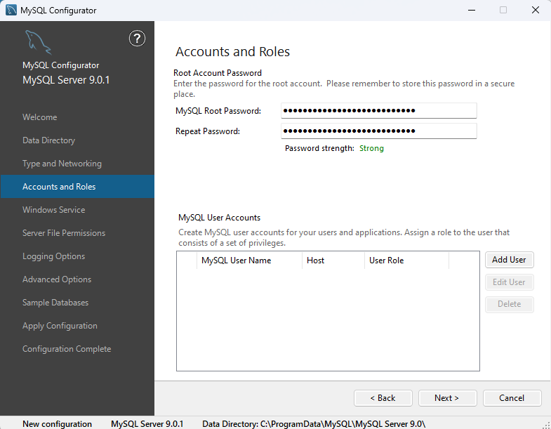
4. The next screen is titled **Windows Service**. Check **Configure MySQL Server as a Windows Service**. You can also rename the Windows Service Name, but I left it as the default. Now if you don't want MySQL Server to run whenever you reboot your computer, uncheck the  **Start the MySQL Server at System Startup** box. Note that if you uncheck the box, you will have to manually restart the MySQL server whenever you want to run it. Select **Standard System Account** and click Next.
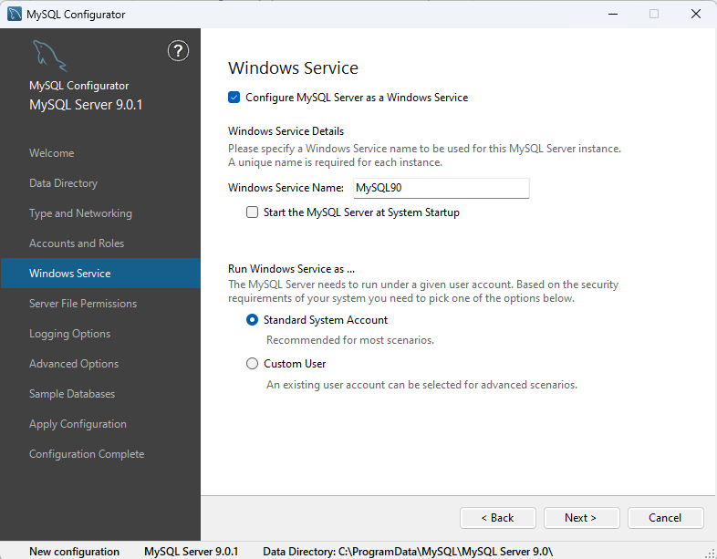
5. On the next screen, it should say **Server File Permissions**. Select the one that grants full access to the user running the Windows Service (this will be you) and click Next.
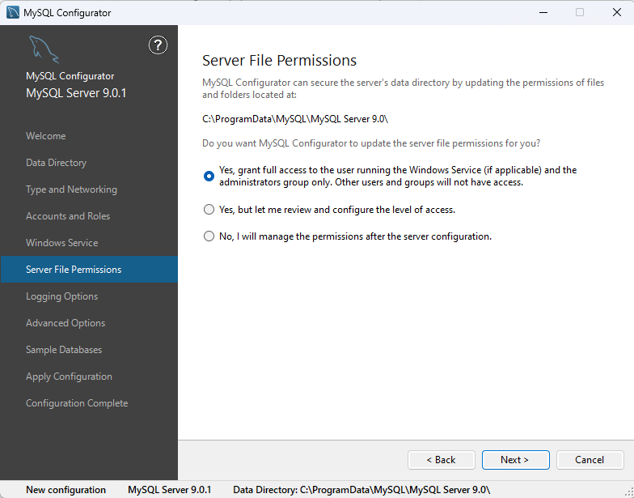
6. The next page should be called **Logging Options**. Leave everything as default and click Next.
7. The next page should be called **Advance Options**. Leave everything as default and click Next.
8. The next page should be called **Sample Databases**. I did not select any databases to be created (neither Sakila nor World) because you should be able to create them at any point (I could be wrong). Click Next.
9. The next page should be called **Apply Configuration**. It will show the steps that the application will take; they are not check boxes (I thought they were check boxes because I didn't read it). Click Execute at the bottom to make those changes.
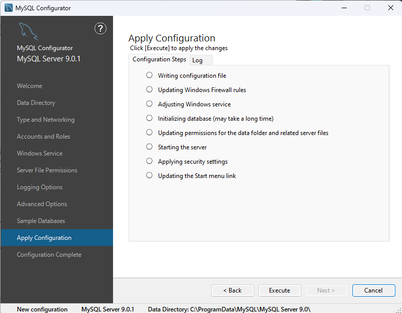
10. After clicking Execute, it will go through the steps and might take a few seconds to update permissions for the data folder or to start the server. This is normal. Once it's done, you should see "The configuration for MySQL Server 9.0.1 was successful" at the bottom of the screen. Click Next.
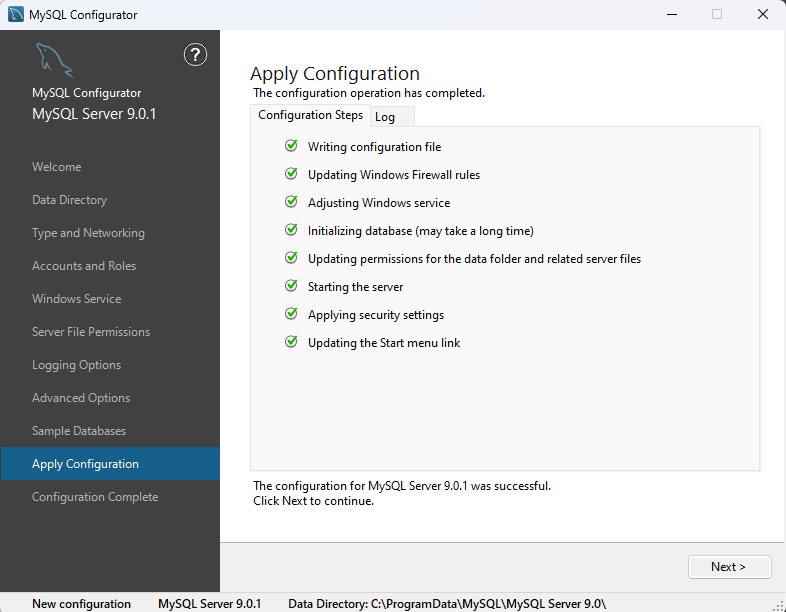
11. The final screen should say **Configuration Complete**. I didn't copy the log to keyboard because I wouldn't know what to do with that, so just click Finish.
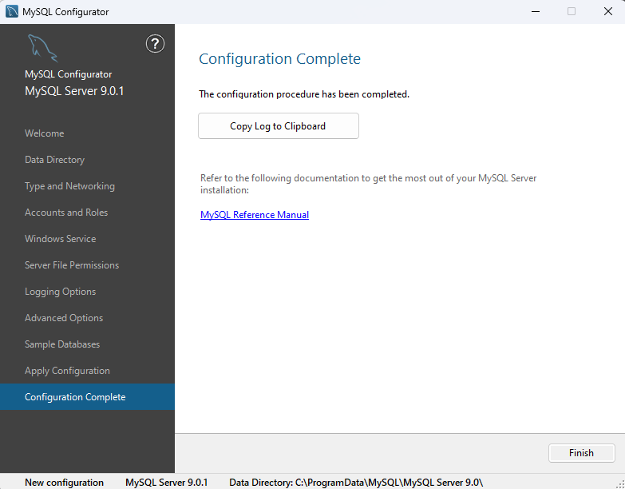

Congratulations! You are now done downloading MySQL Server. The next step to actually use it is to download MySQL Workbench.

## MySQL Workbench
uh here's the link: [https://dev.mysql.com/downloads/workbench/](https://dev.mysql.com/downloads/workbench/)