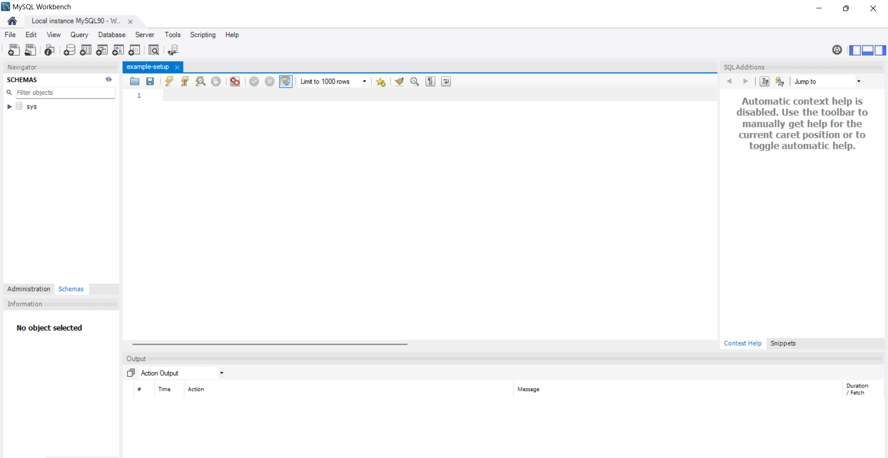

# How to set up MySQL Community Server and MySQL Workbench
This guide was originally meant to be used for DATA 220P at UC Irvine in Fall 2024. Note that the author has only attempted installation for Windows 11, so any debugging on Mac OS or Linux will have to be done on your own. Feel free to jump around to the sections you need help with.
- [MySQL Community Server](#mysql-community-server)
     - [MySQL Server Setup Wizard](#mysql-server-setup)
     - [MySQL Configurator Wizard](#mysql-configurator-setup)
- [MySQL Workbench](#mysql-workbench)
     - [MySQL Workbench Setup Wizard](#mysql-workbench-setup-wizard)
- [Testing MySQL Installations](#testing-mysql-installations)

## MySQL Community Server
[jump to top](#how-to-set-up-mysql-community-server-and-mysql-workbench)

The first step is to download the latest version of MySQL Community Server, found at [https://dev.mysql.com/downloads/mysql/](https://dev.mysql.com/downloads/mysql/). The version as of writing this guide is v9.0.1.


From this list of installers, click Download next to the Windows MSI Installer. This will bring you to a page that looks like this:


If you don't want to log in or sign up for an Oracle Web Account, just click the **No thanks, just start my download.** button below the account buttons. This should download a file called `mysql-9.0.1-winx64.msi` to your computer. This is the installer for MySQL Community Server. Run this file.

### MySQL Server Setup
[jump to top](#how-to-set-up-mysql-community-server-and-mysql-workbench)

You should see an application pop up called MySQL Server 9.0 Setup with a welcome page to the installation wizard. We will now go through the steps for this wizard.

1. Click Next. You should see an End-User License Agreement. Accept the terms and click Next.

2. You should see **Choose Setup Type** at the top of the wizard. Click *Typical*.

3. The wizard should now say **Ready to install MySQL Server 9.0**. Click Install. When Windows asks for permission, accept it.
4. Once installation is complete, you should see a screen that says **Completed the MySQL Server Setup Wizard**. At the bottom of this screen, there is a check box that says **Run MySQL Configurator**. Make sure that this is checked, as this is the next step for the installation. Click Finish.


# MySQL Configurator Setup
[jump to top](#how-to-set-up-mysql-community-server-and-mysql-workbench)

Windows will ask if you want mysql_configurator.exe to have some permissions; allow it. Now you should see an application window titled MySQL Configurator with a welcome page for this configurator. We will now go through the steps for this configurator wizard.

1. Click Next. You should see a screen titled **Data Directory**. This is where MySQL Server 9.0 and all its related data will be stored. The default is usually good enough, but if you have a specific directory that you want, choose that one instead. Click Next.

2. The screen should be titled **Type and Networking**. Make sure the Config Type is `Development Computer`, connectivity has TCP/IP checked, Port is `3306`, X protocol Port is `33060`, and *Open Windows Firewall ports for network access* is checked. These are usually the default options. It is also a good idea to check **Show Advanced and Logging Options** before you click Next.

3. The next screen should be titled **Accounts and Roles**. This is where you will choose a MySQL Root Password, so make sure it is strong. You can also create MySQL User Accounts, but this is not necessary. After entering a root password, click Next.

4. The next screen is titled **Windows Service**. Check **Configure MySQL Server as a Windows Service**. You can also rename the Windows Service Name, but I left it as the default. Now if you don't want MySQL Server to run whenever you reboot your computer, uncheck the  **Start the MySQL Server at System Startup** box. Note that if you uncheck the box, you will have to manually restart the MySQL server whenever you want to run it. Select **Standard System Account** and click Next.

5. On the next screen, it should say **Server File Permissions**. Select the one that grants full access to the user running the Windows Service (this will be you) and click Next.

6. The next page should be called **Logging Options**. Leave everything as default and click Next.
7. The next page should be called **Advance Options**. Leave everything as default and click Next.
8. The next page should be called **Sample Databases**. I did not select any databases to be created (neither Sakila nor World) because you should be able to create them at any point (I could be wrong). Click Next.
9. The next page should be called **Apply Configuration**. It will show the steps that the application will take; they are not check boxes (I thought they were check boxes because I didn't read it). Click Execute at the bottom to make those changes.

10. After clicking Execute, it will go through the steps and might take a few seconds to update permissions for the data folder or to start the server. This is normal. Once it's done, you should see "The configuration for MySQL Server 9.0.1 was successful" at the bottom of the screen. Click Next.

11. The final screen should say **Configuration Complete**. I didn't copy the log to keyboard because I wouldn't know what to do with that, so just click Finish.


Congratulations! You are now done downloading MySQL Server. The next step to actually use it is to download MySQL Workbench.

## MySQL Workbench
[jump to top](#how-to-set-up-mysql-community-server-and-mysql-workbench)

The next step is to download the latest version of MySQL Workbench, found at [https://dev.mysql.com/downloads/workbench/](https://dev.mysql.com/downloads/workbench/). The version as of writing this guide is v8.0.38. Note that this version is **not fully compatible** with MySQL Server 9.0 (or even 8.4 and above) but this is not too important; we'll get into that later.

There are not many options here; just click Download on the MSI Installer. You will again see the screen that wants you to log in; you can just click **No thanks, just start my download** at the bottom.

Run the file. For me, it is called `mysql-workbench-community-8.0.38-winx64.msi`.

### MySQL Workbench Setup Wizard
[jump to top](#how-to-set-up-mysql-community-server-and-mysql-workbench)

You should see an application pop up called MySQL Workbench 8.0 CE - Setup Wizard (or something similar). We will go through the steps for this wizard.
1. Click Next on the application welcome screen.

2. The next page should say **Destination Folder** at the top. Again, I left it as default, but if you know what you're doing, you can change the folder. Click Next when you're satisfied.

3. The next page should say **Setup Type** at the top. Select **Complete** and click Next.

4. The next page should say **Ready to Install the Program**. Click Install.

5. The next page is an installation progress bar, but at some point, Windows will ask if you want to allow 5d0ca6a2.msi (or something) to make changes to your device. Allow this, and the progress bar will continue until Workbench is installed.
6. Once Workbench has been successfully installed, the page will say **Wizard Completed** at the top. If you wish to test your installations now, check the **Launch MySQL Workbench now** box. Otherwise, you can always run it via the Start menu. Click Finish.


Now MySQL Workbench is downloaded on your computer! Congratulations; everything you need has been downloaded. The next steps are to test if everything works together, and to do this, we have some test scripts.

## Testing MySQL Installations
[jump to top](#how-to-set-up-mysql-community-server-and-mysql-workbench)

We are now ready to use MySQL Workbench and connect it to MySQL Server. When you open MySQL Workbench, you will see a screen similar to this one:

For me, I already had the Local instance of MySQL90 showing up at the bottom. I don't know if this is the case for everyone, but the MySQL documentation is pretty good (I think). It can be found at [https://dev.mysql.com/doc/workbench/en/wb-mysql-connections-new.html](https://dev.mysql.com/doc/workbench/en/wb-mysql-connections-new.html).

In any case, once you have connected to your instance, click on it. If you downloaded MySQL Community Server v9.0.1 and MySQL Workbench v8.0.38 like me, you will see this warning pop up:

This warning essentially says MySQL Server v8.4 and above may have increased functionalities that MySQL Workbench 8.0 is not compatible with yet. Click Continue Anyway (and if you want, you can have it not show the warning anymore by checking Don't show this message anymore).

You will now see a blank script. I saved mine and named it `example-setup.sql` in a folder that I know the location of.


Copy and paste the following code into your sql file (the text can also be found in MySQL_example_queries/example-setup.sql):
```
-- beginning of script
CREATE DATABASE IF NOT EXISTS `data220p` DEFAULT CHARACTER SET latin1;
USE `data220p`;

-- `Boats` table structure
DROP TABLE IF EXISTS `Boats`;
CREATE TABLE `Boats` (
`bid` int(11) NOT NULL,
`bname` varchar(45) DEFAULT NULL,
`color` varchar(15) DEFAULT NULL,
PRIMARY KEY (`bid`)
) ENGINE=InnoDB DEFAULT CHARSET=latin1;

-- `Boats` data dump
ALTER TABLE `Boats` DISABLE KEYS;
INSERT INTO `Boats` VALUES (101,'Interlake','blue'),(102,'Interlake','red'),(103,'Clipper','green'),(104,'Marine','red');
ALTER TABLE `Boats` ENABLE KEYS;

-- `Boats2` table structure
DROP TABLE IF EXISTS `Boats2`;
CREATE TABLE `Boats2` (
  `bid` int(11) NOT NULL,
  `bname` varchar(45) DEFAULT NULL,
  `color` varchar(15) DEFAULT NULL,
  PRIMARY KEY (`bid`)
) ENGINE=InnoDB DEFAULT CHARSET=latin1;

-- `Boats2` data dump
ALTER TABLE `Boats2` DISABLE KEYS;
INSERT INTO `Boats2` VALUES (103,'Clipper','green'),(104,'Marine','red'),(105,'InterClipper','blue'),(106,'InterMarine','red');
ALTER TABLE `Boats2` ENABLE KEYS;

-- `Reserves` table structure
DROP TABLE IF EXISTS `Reserves`;
CREATE TABLE `Reserves` (
  `sid` int(11) DEFAULT NULL,
  `bid` int(11) DEFAULT NULL,
  `date` date DEFAULT NULL
) ENGINE=InnoDB DEFAULT CHARSET=latin1;

-- `Reserves` data dump
ALTER TABLE `Reserves` DISABLE KEYS;
INSERT INTO `Reserves` VALUES (22,101,'1998-10-10'),(22,102,'1998-10-10'),(22,103,'1998-10-08'),(22,104,'1998-10-07'),(31,102,'1998-11-10'),(31,103,'1998-11-06'),(31,104,'1998-11-12'),(64,101,'1998-09-05'),(64,102,'1998-09-08'),(74,103,'1998-09-08'),(NULL,103,'1998-09-09'),(1,NULL,'2001-01-11'),(1,NULL,'2002-02-02');
ALTER TABLE `Reserves` ENABLE KEYS;

-- `Reserves2` table structure
DROP TABLE IF EXISTS `Reserves2`;
CREATE TABLE `Reserves2` (
  `sid` int(11) DEFAULT NULL,
  `bid` int(11) DEFAULT NULL,
  `date` date DEFAULT NULL
) ENGINE=InnoDB DEFAULT CHARSET=latin1;

-- `Reserves2` data dump
ALTER TABLE `Reserves2` DISABLE KEYS;
INSERT INTO `Reserves2` VALUES (22,103,'1998-10-10'),(22,104,'1998-10-10'),(22,105,'1998-10-08'),(22,106,'1998-10-07'),(31,103,'1998-11-10'),(31,104,'1998-11-06'),(31,105,'1998-11-12'),(64,104,'1998-09-05'),(64,105,'1998-09-08'),(74,105,'1998-09-08'),(NULL,104,'1998-09-09'),(108,NULL,'2001-01-11'),(108,NULL,'2002-02-02');
ALTER TABLE `Reserves2` ENABLE KEYS;

-- `Sailors` table structure
DROP TABLE IF EXISTS `Sailors`;
CREATE TABLE `Sailors` (
  `sid` int(11) NOT NULL,
  `sname` varchar(45) NOT NULL,
  `rating` int(11) DEFAULT NULL,
  `age` decimal(5,1) DEFAULT NULL,
  PRIMARY KEY (`sid`)
) ENGINE=InnoDB DEFAULT CHARSET=latin1;

-- `Sailors` data dump
ALTER TABLE `Sailors` DISABLE KEYS;
INSERT INTO `Sailors` VALUES (22,'Dustin',7,45.0),(29,'Brutus',1,33.0),(31,'Lubber',8,55.5),(32,'Andy',8,25.5),(58,'Rusty',10,35.0),(64,'Horatio',7,35.0),(71,'Zorba',10,16.0),(74,'Horatio',9,35.0),(85,'Art',4,25.5),(95,'Bob',3,63.5),(101,'Joan',3,NULL),(107,'Johannes',NULL,35.0);
ALTER TABLE `Sailors` ENABLE KEYS;

-- `Sailors2` table structure
DROP TABLE IF EXISTS `Sailors2`;
CREATE TABLE `Sailors2` (
  `sid` int(11) NOT NULL,
  `sname` varchar(45) NOT NULL,
  `rating` int(11) DEFAULT NULL,
  `age` decimal(5,1) DEFAULT NULL,
  PRIMARY KEY (`sid`)
) ENGINE=InnoDB DEFAULT CHARSET=latin1;

-- `Sailors2` data dump
ALTER TABLE `Sailors2` DISABLE KEYS;
INSERT INTO `Sailors2` VALUES (22,'Dustin',7,45.0),(31,'Lubber',8,55.5),(64,'Horatio',7,35.0),(71,'Zorba',10,16.0),(74,'Horatio',9,35.0),(85,'Art',4,25.5),(95,'Bob',3,63.5),(101,'Joan',3,NULL),(107,'Johannes',NULL,35.0),(108,'Sandy',NULL,36.0),(109,'James',5,38.0);
ALTER TABLE `Sailors2` ENABLE KEYS;
-- The end of the script
```

Once this is copied and pasted (and you should read it a little to get a good vibe of how to do certain things in SQL), click on the little lightning icon near the top to execute the query.


To check if this has worked, first click on **Schemas** at the bottom of the *Navigator* tab on the left side, then click the refresh button next at the right of **SCHEMAS**.


If it worked, you should see a new schema titled **data220p** with some Tables, Views, Stored Procedures, and Functions. Now to check if the table was populated properly, save your script and create a new query with CTRL+T or File > New Query Tab. I saved mine in a folder that I know the location of and called it `example-check.sql`. Type in the following instruction to the query (also found in MySQL_example_queries/example-check.sql):
```
SELECT * FROM data220p.Boats;
```

and click on the Execute button again. You should see a **Result Grid** with three columns - `bid`, `bname`, and `color` - as well as values within each column, corresponding to what we input in `example-setup.sql`.


If what you see is the same as the image above, then congratulations! MySQL Server and Workbench have been downloaded properly, and you are ready for class.

[jump to top](#how-to-set-up-mysql-community-server-and-mysql-workbench)